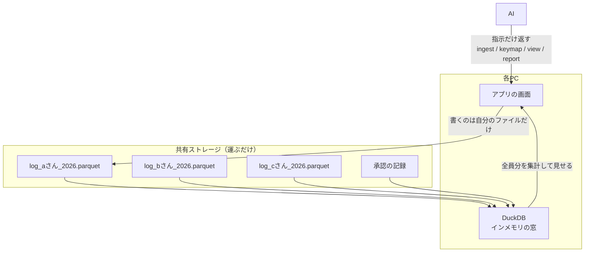

# AI Native Groupware

**サーバーを立てない。共有ストレージに一人一ファイル、計算は各PCの DuckDB。**

実績の集計、日報、承認、帳票。社内の業務データを、SaaS も社内のDBサーバーも立てずに全員で回すための構造。
置くのは、会社がもう持っている共有ストレージ（Box・OneDrive・SharePoint・ファイルサーバー）だけ。計算は各PCの中で DuckDB がやる。

---

## 困りごと

社内で「みんなが書いて、みんなが見る」仕組みを作ろうとすると、今の答えは3つで、どれも痛い。

| やり方 | 起きること |
|---|---|
| **SaaS に預ける** | 人数と使った量で毎月払い続ける。データは社外に出る。業務に合わせた直しは自社でできない。 |
| **社内にDBサーバーを立てる** | 稟議・運用・保守が付いてくる。そこが落ちると全員が止まる。 |
| **共有フォルダにDBファイルを置いて全員で書く** | 壊れる。Access で何十年も繰り返されてきた失敗で、Microsoft 自身が SharePoint や OneDrive から開かないよう勧めている。 |

AI Native Groupware は4つ目の道を取る。**同じものを、二人で書かない。**

## 仕組み

1. **一人一ファイル** — 書くのは自分のファイルだけ。名前は `用途_ユーザー_年.parquet`。同じファイルを二人が同時に更新する状況が起きないので、共有ストレージの「競合したコピー」は原理的に出ない。Parquet は追記できないが、書き直すのが自分の1年分だけなら数ミリ秒で済む。
2. **DuckDB は器ではなく窓** — DuckDB のファイルを共有ストレージに置かない。各PCがインメモリで全員の Parquet をまとめて読み、集計して見せる。手元に置くのは、壊れても作り直せるものだけ。
3. **承認を、ただ一つの決定点にする** — ロックも、即時の整合も使わない。みんなで決めることは「承認の記録」で決着させる。
4. **AI には指示だけを返させる** — AI はデータを直接書き換えない。取り込み（ingest）・対応表（keymap）・見え方（view）・帳票（report）の指示を返し、アプリがそれを実行する。誰が何をできるかはアプリが判定し、帳票は定義だけを共有する。
5. **汎用の芯と、会社ごとの枝** — 科目の体系、組織や拠点の台帳、業務の流れは設定として差し込む。台帳（何が在るか）と対応表（各データを台帳に合わせる辞書）は分けて持つ。

## 実測

1台のPCのローカルディスクで測った値（2026-09）。共有ストレージの同期にかかる時間は含まない。

| 何を | 規模 | 時間 |
|---|---|---|
| 全員分をまとめて読む | 300人 × 各240行（300ファイル・計3.41MB）＝72,000件 | 10ms |
| 人ごとに集計する | 同上 | 14ms |
| 自分のファイルに1件足す（丸ごと書き直し） | 1人1年分・240行・11KB | 2〜8ms |
| 3年分の日報から1か月を抜く | 300人 × 20営業日 × 3年＝216,000件（36ファイル・8.49MB） | 4ms |

速さは決め手ではない。同じ速さはサーバーを立てても出る。決め手は、**壊れないことと、止まらないこと**。落ちたら全員が止まる1台が、どこにも無い。

## できること・できないこと

**できる** — 読むことが中心の業務。実績の集計、帳票、分析、履歴、日報、メッセージ、在席、月次の承認のような流れ。普通の基幹システムの BI の部分は、これで足りる。

**できない（本物のDBが要る）**

1. **同じ一行を取り合うもの** — 在庫、残高、会議室の予約。
2. **その場で全員が同じ値を見る必要があるもの** — 即時の整合。
3. **何人ものファイルにまたがる取り消し**

この3つは、取引を持つ販売や会計のシステムの中で起きている。こちらに降りてくるのは、起きた後の数字だけ。

共有できる DuckDB（DuckLake、Quack）は実在する。ただ、どれも共有するならどこかに1台、調停役のサーバーが立つ。形式が新しくなっても、そこは変わらない。共有ストレージには調停役がいない。運ぶだけ。だからこの構造は、調停が要るものを持ち込まない。

## 配る形

- アプリは共有ストレージに置いた実行ファイル1本。全員がショートカットで開く。差し替えれば、次に開いた人から新しい版になる。自動更新の仕組みは要らない。
- 社内向けは Python ＋ ブラウザのアプリモード（アドレスバーの無い窓）。社外に出す版は Tauri（インストーラ 1.6MB、ポートを開けない）。画面は素の HTML なので、どちらにも載る。

## 関連する考え方

- **ローカルファースト** — 本流は CRDT で、「同じものを何人かで編集する」方向へ進んだ。ここは逆で、そもそも同じものを編集しない。用途と人でファイルを割る。CRDT より単純で、壊れる経路が少ない。業務システムならこちらが素直だと考えている。
- **「ビッグデータは死んだ」** — ほとんどの会社が分析するデータは、1台のPCに収まる（[Jordan Tigani, 2023](https://motherduck.com/blog/big-data-is-dead/)）。
- **[MeaningSpace](https://github.com/subtractlab/meaningspace)** — 数字は一人一ファイルの Parquet、文脈（その数字がなぜ動いたか）は MeaningSpace に置く。全員で書き、全域を読む意味の層は、この方式だけでは足りない。そこは別の設計にしている。

## ここにあるもの・無いもの

このリポジトリは**設計の公開記録（日付付き）**で、インストールできるパッケージではない。実装は公開していない。

今どこ: 一人一ファイルの読み書きの速さと、共有ストレージの更新フォルダを通したアプリ更新（社外版の Tauri）は実測済み。業務アプリとしては、データ取り込みのウィザードから順に作っている。

似たものを作りたい、自社で使う話をしたい、という人は **subtractlab.com** から連絡を。

---

**[SubtractLab](https://github.com/subtractlab)** の一部 · 作者: 奥田剛司 · [subtractlab.com](https://subtractlab.com) · English: [README.md](README.md)
