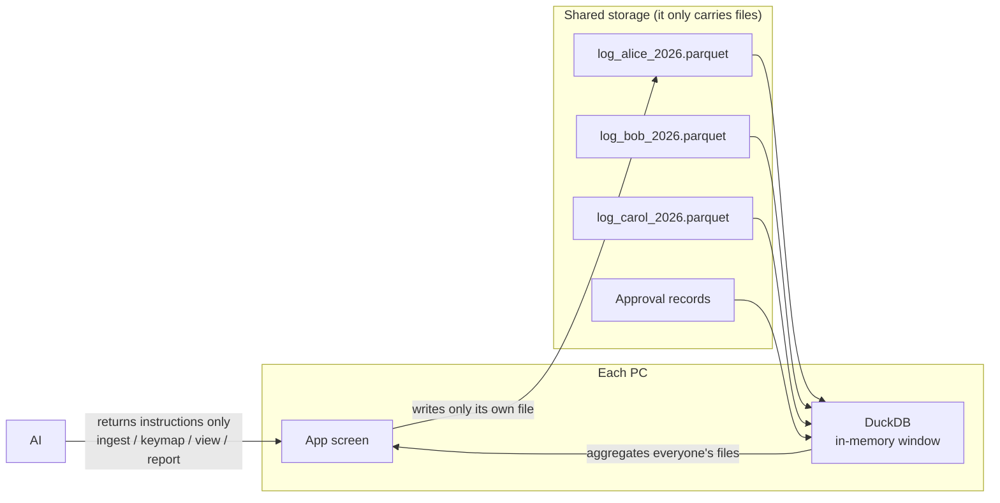

# AI Native Groupware

**No server. One file per person on shared storage. DuckDB on every PC.**

Results, daily reports, approvals, reports. A structure for running a team's business data without a SaaS and without an in-house database server.
The only shared thing is storage the company already has (Box, OneDrive, SharePoint, a file server). Every PC does its own computing with DuckDB.

---

## The problem

When a company wants "everyone writes, everyone reads", today's answers come in three kinds, and each one hurts.

| Approach | What happens |
|---|---|
| **Hand it to a SaaS** | You pay every month by seat and by usage. The data leaves the company. You can't reshape it to your own work. |
| **Run a database server in-house** | Approvals, operations and maintenance come with it. When it goes down, everyone stops. |
| **Put a database file in a shared folder and let everyone write** | It breaks. Access has repeated this failure for decades, and Microsoft itself advises against opening Access files from SharePoint or OneDrive. |

AI Native Groupware takes a fourth path: **no two people ever write the same thing.**

## How it works

1. **One file per person** — you write only your own file, named `purpose_user_year.parquet`. Two people never update the same file at the same time, so shared storage never produces "conflicted copies". Parquet can't be appended to, but rewriting one person's year takes milliseconds.
2. **DuckDB is a window, not a container** — no DuckDB file ever sits on shared storage. Each PC reads everyone's Parquet files in memory, aggregates, and shows the result. Only things that can be rebuilt live locally.
3. **Approval is the single decision point** — no locks, no immediate consistency. Anything decided together is settled by an approval record.
4. **AI returns instructions, never edits** — the AI does not touch the data. It returns instructions for ingest, keymap, view and report, and the app carries them out. The app decides who may do what; reports are shared as definitions only.
5. **A generic core, company-specific branches** — chart of accounts, the registry of units and sites, the flow of work: all plugged in as configuration. The registry (what exists) is kept apart from the keymaps (dictionaries that align each data source to the registry).

## Measured

On one PC's local disk (2026-09). Shared-storage sync time is not included.

| What | Scale | Time |
|---|---|---|
| Read everyone at once | 300 people × 240 rows each (300 files, 3.41 MB) = 72,000 rows | 10 ms |
| Aggregate per person | same | 14 ms |
| Add one row to your own file (full rewrite) | one person-year, 240 rows, 11 KB | 2–8 ms |
| Pull one month from three years of daily reports | 300 people × 20 workdays × 3 years = 216,000 rows (36 files, 8.49 MB) | 4 ms |

Speed is not the point; a server is just as fast. The point is that **nothing breaks and nothing stops**. There is no single machine whose failure stops everyone.

## What it can and can't do

**Can** — work that is mostly reading: results, reports, analysis, history, daily reports, messages, presence, monthly approval flows. The BI side of a typical business system fits.

**Can't (needs a real database)**

1. **Things people compete for** — stock, balances, meeting-room bookings.
2. **Things everyone must see identically right now** — immediate consistency.
3. **Undo that spans several people's files**

These three happen inside the systems that own transactions (sales, accounting). What reaches this layer is the numbers after the fact.

Shareable DuckDB does exist (DuckLake, Quack). But sharing it always puts one server somewhere to arbitrate; a newer format doesn't change that. Shared storage has no arbiter, it only carries files. So this structure keeps out everything that needs arbitration.

## How it ships

- The app is a single executable on shared storage. Everyone opens it through a shortcut. Replace the file and the next person who opens it gets the new version. No auto-update machinery.
- Internally: Python plus a browser app window (no address bar). For outside customers: Tauri (1.6 MB installer, no open port). The screens are plain HTML, so they run on both.

## Related ideas

- **Local-first** — the mainstream went to CRDTs: several people editing the same thing. This goes the other way: nobody edits the same thing. Files are split by purpose and by person. Simpler than CRDTs, with fewer ways to break. For business systems I think this is the more natural fit.
- **"Big data is dead"** — most companies' analytical data fits on one machine ([Jordan Tigani, 2023](https://motherduck.com/blog/big-data-is-dead/)).
- **[MeaningSpace](https://github.com/subtractlab/meaningspace)** — numbers live in per-person Parquet; context (why a number moved) lives in MeaningSpace. A layer of meaning that everyone writes and that is read across its whole range is not served by this method alone; it has its own design.

## What is and isn't here

This repository is a **dated public record of a design**, not an installable package. The implementation is not published.

Status: read/write speed for one-file-per-person and app updates through a shared-storage update folder (the Tauri edition) are measured. As a business app, it is being built from the data-ingest wizard onward.

If you want to build something similar or talk about using it in your company, get in touch through **subtractlab.com**.

---

Part of **[SubtractLab](https://github.com/subtractlab)** · by Koji Okuda · [subtractlab.com](https://subtractlab.com) · 日本語: [README.ja.md](README.ja.md)
